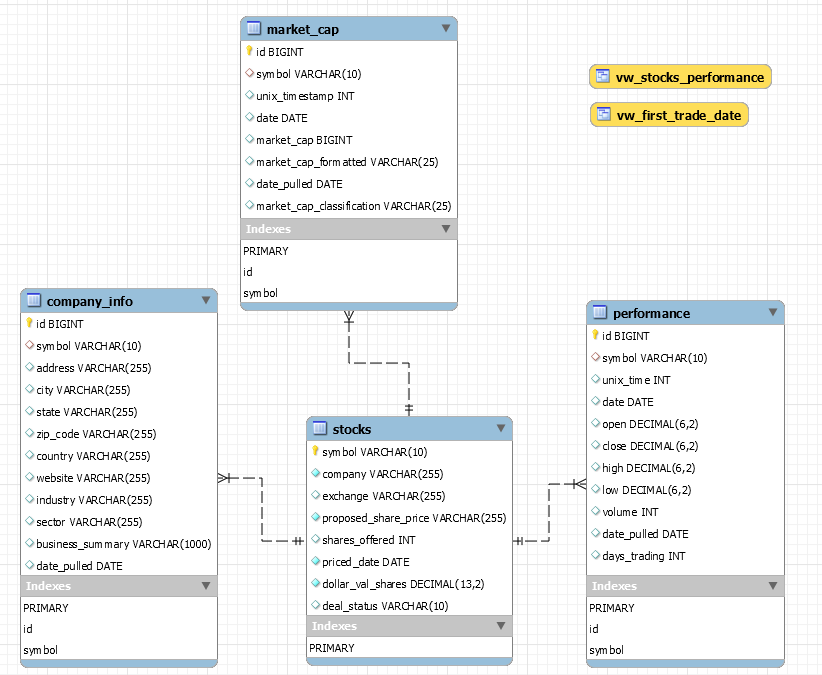

_note: additional development ongoing_ 

# IPO Tracker
This project was created as I was frustrated by how challenging it was to find analysis on IPO stocks schedules, performance, and analysis. The idea was to get IPO data from the web, build a database, and complete analysis.
  
  

# Datasource
The data comes from two locations, and uses Python Requests to get the information. Sources are:

**(1) Nasdaq**

For upcoming stocks (note: does include IPOs on other exchanges)

**(2) Yahoo Finance** 

For stock performance, company characteristics, and other metrics.

  
  

# Database

After the data is cleaned and transformed it is loaded to a MySQL database. Additional value add measures are added to the database with stored procedures and views (Ex: adding market cap classifications).

**Initial Schema Setup**  

_Additional tables may be added as additional features are built out_ 

# Analysis
Analysis and insights are ongoing, but may include:
- IPOs by state 
- Performance by period milestone vs competitive set (Ex: performance after 30 days) 
- Performance by sector and industry 
- Performance by market cap classification 
  
  

# Twitter Bot
The eventual goal is to create a Twitter bot that proactively tweets out an upcoming IPO schedule along with key milestones (Ex: performance after 30 days) of recent public offerings.

